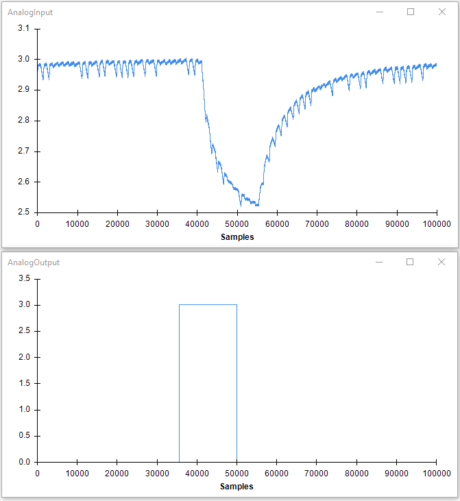

# AI/AO Synchronization

## Summary
This example demonstrates how to send analog outputs and receive analog inputs from a National Instruments board in a synchronized way.

## Workflow

:::workflow

:::

## Details
1. Reads analog inputs from a NIDAQ board. The ports to be read are defined in the *Channels* property. In this example we are using analog input 0 (ai0). The node is set to collect analog inputs at 100000Hz divided in buffers of 10000 samples. The *SignalSource* property, which defines the clock signal, is set to be the same as that used for the analog output ports (see 2.3).
2. Generates a sawtooth function of with amplitude of 0.7 and frequency of 1Hz (in a buffer with size 10000), converts it into a step function and sends it to the analog output 0 (ao0).
    1. Creates the step function by rounding the input float values (which are in the range \[0,0.7\]) to integer values of 0 or 1.
    2. Converts the signal back to floats and amplifies them by a factor of 3. This the final voltage values set in the analog output (2.3)
    3. Sends a buffer with a step signal to the analog output port 0 (ao0) every 100ms, generating a total of 10 steps cycles per second. 

## Testing
The synchronization of the two signals can easily be tested by connecting the analog output to a LED and the analog input to a light-sensitive photodiode. If the result is correct, the two waves should be phase-locked to each other as shown below.* 

{ width=50% }

*Note though that you could potentially observe a constant phase-shift between them; this is because at the moment the DAQmx package does not allow yet for using the same trigger to initiate the analog input and output ports.

