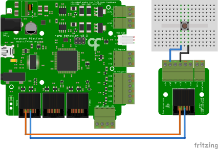

# Analog Input

## Summary
This example demonstrates how to read digital input values from the DIO Port0 using the [Harp Behavior](https://harp-tech.org/api/Harp.Behavior.html) board (see hardware schematics below).

## Workflow

:::workflow

:::

## Details
1. Creates a connection with the Behavior board. The PortName property in the Behavior node needs to be set to the COM device on the computer. 
2. Filters the messages from the Behavior board that pertain DIO port inputs.
3. Selects the DIO0 from the list of possible DIO inputs (see the output of the Parse node in 2).

## Requirements
This example requires the following Bonsai packages:
- Harp - Behavior (from nuget.org)

## Schematics
The [Harp Behavior](https://harp-tech.org/api/Harp.Behavior.html) board has seven digital input channels:  DIPort0, DIOPort0, DIPort1, DIOPort1, DIPort2, DIOPort2, and DI3. The maximum tolerable voltage at these ports is 5V. In this example, the board receives a digital input signal from a switch connected to DIOPort0.

{ width=65% }
