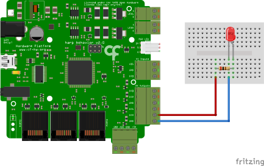

# Log Selected

## Summary
This example demonstrates how to log the events that control the ON/OFF state of a LED using the [Harp Behavior](https://harp-tech.org/api/Harp.Behavior.html) board (see hardware schematics below). 

## Workflow
:::workflow

:::

## Details
1. Establishes the commands to be sent to the Behavior board and publishes all the events from the device. The PortName property in the Behavior node needs to be set to the COM device on the computer. To create the subject node, right-click on the Behavior node -> Create Source -> Behavior Subject, and name it accordingly. 
    1. Filters all the messages from the Behavior board that set digital output ports to ON.
    2. Filters all the messages from the Behavior board that set digital output ports to OFF.
2. Turns the LED ON when 'A' is pressed.
3. Turns the LED OFF when 'S' is pressed.
4. Ensures that command messages are sent only when the device is ready.

## Requirements
This example requires the following Bonsai packages:
- Harp - Behavior (from nuget.org)

## Schematics
All the messages to and from the [Harp Behavior](https://harp-tech.org/api/Harp.Behavior.html) can be logged. In this example, only data relative setting and clearing of digital output ports is logged. 

{ width=65% }

## CSV Conversion
It's often desirable to convert the binary files that come out of the MessageWriter node into a human readable file. One way to do this is to convert them into CSV files through the [Harp Convert To CSV](https://github.com/harp-tech/csv_converter) GUI.
