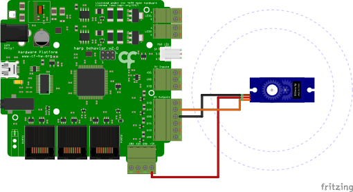

# Servo Motor Toggle

## Summary
This example demonstrates how to toggle a servo motor between two positions using [Harp Behavior](https://harp-tech.org/api/Harp.Behavior.html) board (see hardware schematics below). 

## Workflow
:::workflow

:::

## Details
1. Establishes the commands to be sent to the Behavior board and publishes all the events from the device. To create the subject node, right-click on the Behavior node -> Create Source -> Behavior Subject, and name it accordingly. 
2. Sets the period of the servo motor's PWM in microseconds. Normal servos use a period of $20000\mathsf{\mu s}$.
3. Enables the servo motor.
4. Sets the minimum position of the servo motor when 'A' is pressed.* 
5. Sets the maximum position of the servo motor when 'S' is pressed.*
6. Ensures that command messages are sent only when the device is ready.   

*The angular position of servo motors is typically defined by the pulse width time of a PWM signal. This value typically ranges from $1000\mathsf{\mu s}$ (minimum) and $2000\mathsf{\mu s}$ (maximum).

## Requirements
This example requires the following Bonsai packages:
- Harp - Behavior

## Schematics
The [Harp Behavior](https://harp-tech.org/api/Harp.Behavior.html) board can control two servo motors in ports DO2 and DO3. The DOs output voltage is 5V. In this example, the board controls controls the position of a servo motor connected to DO2. 

{ width=65% }
