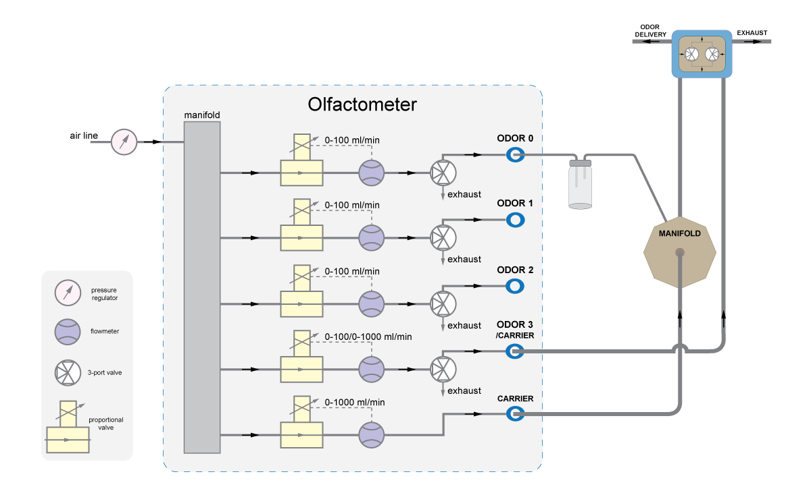

# End Valve Toggle

## Summary
This example demonstrates how to configure the Harp Olfactometer to toggle the End valve using the [Harp Olfactometer](https://github.com/harp-tech/device.olfactometer) board (see hardware diagram below).

## Workflow

:::workflow

:::

## Details

1. Creates a subject node to send commands to the Olfactometer board and publishes all the events from the device. The PortName property in the Olfactometer node needs to be set to the COM device on the computer. To create the subject node, right-click on the Olfactometer node -> Create Source -> Behavior Subject, and name it accordingly.
    1. Filters event messages associated with the Channel 0 flow rate.
    2. Filters event messages associated with the Channel 3 flow rate. 
    3. Filters event messages associated with the Channel 4 flow rate.  
2. Enables the Olfactometer flow by pressing the 'B' key.
3. Disables the Olfactometer flow by pressing the 'E' key.
4. Enables the End valve to be configured with hardware generated pulse.
5. Configures the value (in milliseconds) of the End valve pulse.
6. Selects the Channel 3 flow range (0-1000 ml/s).
7. Sets the target flow rate for all the channels of the olfactometer. If they are not used they are configure with zero value.
8. Ensures that command messages are sent only when the device is ready.
9. Sets the state of the different valves and End valve to perform a 500 ms odor delivery through the End valve after 'A' key press.
    1. Odor valve 0 and valve 3 (used as auxiliary carrier) are enabled 2 seconds before the End valve toggle.
    2. End valve is enabled and will execute the pre-configured pulse. 
    3. Odor valve 0 and valve 3 are disabled.  

## Requirements

This example requires the following Bonsai package:
- Harp.Olfactometer (from nuget.org) - make sure to select 'Include prerelease'

## Schematics

The [Harp Olfactometer](https://github.com/harp-tech/device.olfactometer) supports up to 4 odor channels and 1 carrier line. When using an End valve, Channel 3 is used as an auxiliary carrier line. 

In this example Channel 0 (odor line) is configured with a 80 ml/min flow rate, Channel 3 (auxiliary carrier) with 800 ml/min and Channel 4 (carrier line) with 720 ml/min. The sum of Channel 0 and Channel 4 flows should match the value of Channel 3 in order to maintain the same flow rate at the output, whether odor is being presented or not. 

After 'A' key press the odor channel flow is enabled, goes through the correspondent vial, mixes with the auxiliary carrier line and is exhausted in the end valve during a time period before the End valve is toggled in order to stabilize the mixture. During this time, clean air is being delivered to the animal through the End valve. After that, the End valve toggles during 500 ms and the odorized air is delivered to the animal while the clean air is exhausted. Finally after the End valve toggling time, the Channel 0 and Channel 3 are disabled. 

{ width=80% }

