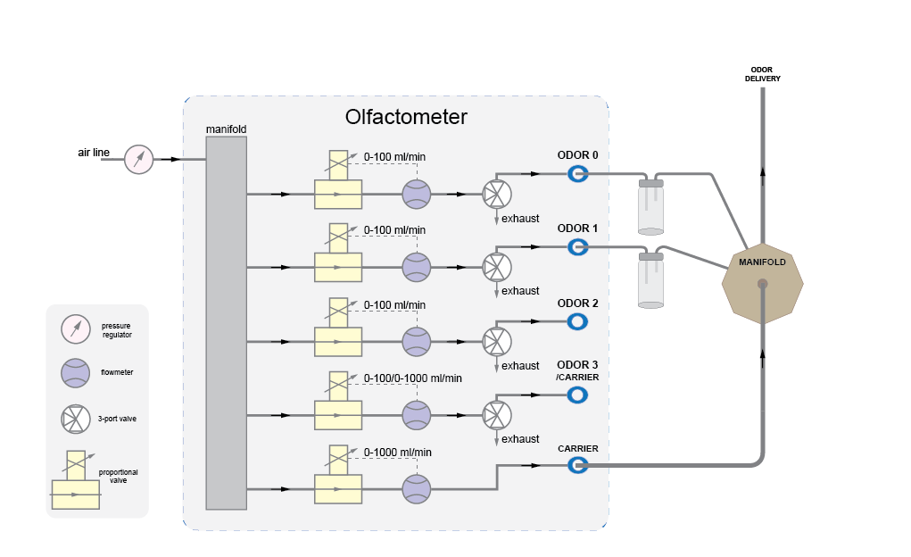

# Odor Valve Toggle

## Summary
This example demonstrates how to configure the Harp Olfactometer to toggle the Odor Valves using the [Harp Olfactometer](https://github.com/harp-tech/device.olfactometer) board (see hardware diagram below).

## Workflow

:::workflow

:::

## Details

1. Creates a subject node to send commands to the Olfactometer board and publishes all the events from the device. The PortName property in the Olfactometer node needs to be set to the COM device on the computer. To create the subject node, right-click on the Olfactometer node -> Create Source -> Behavior Subject, and name it accordingly.
    1. Filters event messages associated with the Channel 0 flow rate.
    2. Filters event messages associated with the Channel 1 flow rate. 
    3. Filters event messages associated with the Channel 4 flow rate.  
2. Enables the Olfactometer flow by pressing the 'B' key.
3. Disables the Olfactometer flow by pressing the 'E' key.
4. Enables the End valve to be configured with hardware generated pulse.
5. Configures the value (in milliseconds) of the Odor valve 0 pulse.
6. Configures the value (in milliseconds) of the Odor valve 1 pulse.
7. Sets the target flow rate for all the channels of the olfactometer. If they are not used they are configure with zero value.
8. Ensures that command messages are sent only when the device is ready.
9. Sets the state of the different valves and End valve to perform a 500 ms odor delivery through the End valve after 'A' key press.
    1. Odor valve 0 is enabled 2 seconds before the Odor valve 1 toggles.
    2. Odor valve 1 is enabled.  

## Requirements

This example requires the following Bonsai package:
- Harp.Olfactometer (from nuget.org) - make sure to select 'Include prerelease'

## Schematics

The [Harp Olfactometer](https://github.com/harp-tech/device.olfactometer) supports up to 4 odor channels and 1 carrier line.

In this example Channel 0 (odor line) is configured with a 80 ml/min flow rate, Channel 1 (odor line) with 80 ml/min and Channel 4 (carrier line) with 720 ml/min. 

After 'A' key press the odor channel 0 flow is enabled, goes through the correspondent vial, mixes with the auxiliary carrier line and is delivered to the animal. The duration of the odor pulse is 500 ms. Then, 2 s after the enabling of odor channel 0, odor channel 1 is also enabled during 500 ms, mixed with the auxiliary carrier line and delivered to the animal.

{ width=80% }

