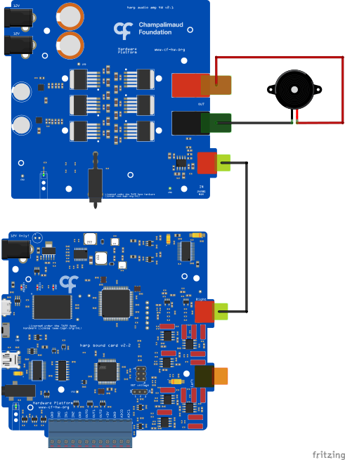

# Load and Play Sound

## Summary
This example demonstrates how to create and load a sound from Bonsai to the [Harp SoundCard](https://harp-tech.org/api/Harp.SoundCard.html) and then play it (see hardware schematics below).

## Workflow
:::workflow

:::

## Details
1. Establishes the commands to be sent to the SoundCard board. The PortName property in the Behavior node needs to be set to the COM device on the computer. To create the subject node, right-click on the SoundCard node -> Create Source -> Behavior Subject, and name it accordingly.
2. Generates and loads a uniform white noise to the SoundCard when `B` is pressed. Find out what is happening [here](#uniform-white-noise-generation).
3. Generates and loads a pure tone to the SoundCard when `C` is pressed. Find out what is happening [here](#pure-tone-generation).
4. This `SelectMany` node converts the array containing the signal to the byte array the SoundCard needs. Find out what is happening [here](#conversion-to-byte-array).
5. Loads the byte array to the SoundCard to index 2.
6. Plays the sound stored at index 2 when `A` is pressed.
7. Sets the attenuation that should be applied to the signal for the left and right channels.
8. Ensures that the command messages are sent only when the device is ready.

### Uniform White Noise Generation
:::workflow

:::
1. Creates a continuous uniform distribution.
2. Samples an array with the desired length from the distribution.

### Pure Tone Generation
:::workflow

:::
1. Initiates an observable sequence with the desired number of samples.
2. Transforms the observable sequence into the desired pure tone signal.
3. Creates the array containing the signal.

### Conversion to Byte Array
:::workflow

:::
1. Creates an observable sequence from the input array.
2. Converts each element into Int32.
3. For each element of the signal, output the corresponding 4 bytes for each channel (8 bytes in total). The `Concat` node forces that this operation is only performed for the element `n` when the same operation finishes for element `n - 1`. Find out how this works [here](#conversion-of-int32-to-respective-bytes).
4. Converts each element into byte (despite the fact that the bytes were calculated before, its representation was still Int32).
5. Creates the array containing the desired byte array.

#### Conversion of Int32 to respective bytes
:::workflow

:::
In order to upload a sound to the SoundCard, the device needs to receive a byte array as input that contains the signal information for both channels (left and right). This information is encoded in the 1-dimensional byte array in the following way: `[byte0_left, byte0_right, byte1_left, byte1_right,...]`.

It's possible that both channels play different sounds, but for this example we want that both channels play the same sound. So for the case where each sample of the signal is given by an Int32 number, the way to get the respective bytes is done as follows:

$$\text{Byte 0} = (\text{Sample} >> 24) \& 255$$

$$\text{Byte 1} = (\text{Sample} >> 16) \& 255$$

$$\text{Byte 2} = (\text{Sample} >> 8) \& 255$$

$$\text{Byte 3} = (\text{Sample} >> 0) \& 255$$

where $>>$ is the right shift operator and $\&$ is the bitwise and operator.

Since we want to use the same bytes for both channels, the part of the byte array containing this sample is given by: `[byte0_left, byte0_right, byte1_left, byte1_right, byte2_left, byte2_right, byte3_left, byte3_right]`.

## Requirements
This example requires the following Bonsai packages:
- Harp - SoundCard (from nuget.org)

## Schematics
The [Harp SoundCard](https://harp-tech.org/api/Harp.SoundCard.html) board has 2 RCA ports (one for the left channel and the other for the right one) which allow the device to connect to a [Harp Audio Amplifier](https://github.com/harp-tech/peripheral.audioamp) on each side which, in turn, connect to a speaker.

{ width=65% }
