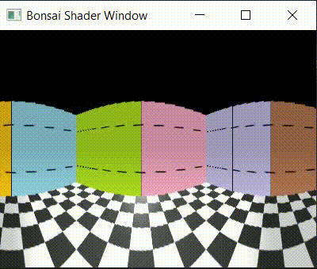

## Virtual Reality
shaders, the graphics library used in Bonsai, 
In this tutorial we will show how to create a virtual, cylindrical environment in Bonsai. It allows a virtual agent to navigate in a squared arena. 

## Getting started

In essence, the VR problem can loosely be resumed to defining the pixel colors of the image that needs to be formed in an agent's eye, in order to give the agent the illusion of being immersed (and moving) in a 3D environment. 

To incorporate virtual reality (VR) worlds into Bonsai (and more broadly into other settings), we need to address three key aspects:
1. Defining the relationship between our current position and the positions of all other objects in the 3D world.
2. Determining the color of each pixel in the image that forms our current view.
3. Ensuring those colors are projected correctly onto the display.

In order to do this, Bonsai uses the Shaders library which provides operators for graphics rendering and dynamic control of OpenGL shader stages within Bonsai's programming language. In this tutorial we will use the Shaders as well as the BonVision libraries to define how a virtual environment is projected onto a 220º cylindrical arena around an animal, using a projector.

In this example, we will create a projection that spans [-110º:110º] projector to create a cylindrical projecti arena. The frontal image is projected directly in the frontal part of the cylider and spans 90º, from -45º to 45º (blue arc). The side images are projected with the aid of two mirrors placed on each side of the cylindrical arena. The left mirror (green) covers the range [-110º, -45º] and the right mirror covers the range [45º,110º].

<p align="center" width="100%">
    
</p>


## Cubemap: First-person view of a 3D world

To set up a VR environment in Bonsai, we first need to populate the 3D scene with objects, usually by adding textured 3D meshes. In this tutorial, the scene will consist of a square room with four walls and a ground floor.

<p align="center" width="100%"> 
        
       
</p>

We then need to create a view of the 3D environment from the perspective of the agent. In Bonsai, this can be done using a Cubemap View centered at the agent’s location. The Cubemap View renders the environment onto the six faces of a cube: +X, -X, +Y, -Y, +Z, and -Z, producing a panoramic 360° view of the scene.

In Bonsai shaders, the Y-axis points upward, and the default direction of the agent is along the -Z axis (i.e when no rotation has been applied). 

The following workflow renders a single view of the Cubemap applied to our 3D scene from the perspective of the agent.

:::workflow

:::

1. Creates a shader window that will render the 3D world, and loads resources related to BonVision, and Textures that will be used to cover the walls and the floor.

2. Renders each frame of to be sent to the display. The RenderFrame node emits a notification whenever the image of our display device is to be updated.
    1. Creates the cubemap view of the environment as mentioned above. At this stage the cubemap is located at (0,0) with an angle of 0º with respect to the virtual environment. 
    2. Emits a notification to the BehaviorSubject, with the current perspective of the cubemap to draw the virtual world according to that view (3).
    3. Renders the cubemap from its current perspective.
    4. Creates a viewpoint to visualize a part of the cubemap. You can change this view point by modifying the rotation and translation positions of the windows' viewpoint.

3. Draws the 3D world according to the perspective of the cubemap (or given the transform it entails in 1). Each branch, binds the wall and floor textures to five planes arranged in a cubic shape.


<p style="text-align:center;"><sup>Adapted from: By SharkD - Own work. Download source code., CC BY-SA 3.0, https://commons.wikimedia.org/w/index.php?curid=8378562</sup></p>


## Navigating in the virtual world

To navigate in the 3D world one needs to modify the position of the cubemap and its orientation to match those of the virtual agent. Before we show how to do this, we need to define how are agent moves. Here, we apply a simple videogame-like strategy, where the keys W and S drive a forward and backward translation of agent, and the keys A and D rotate it left and right. Here, is how this can be implemented in Bonsai:

:::workflow

:::

1. Updates the current camera angle whenever keys A or D are pressed. 
    1. Accumulates the rotation angle
    2. Sets the CameraOrientation subject with the updated rotation angle of the camera

2. Updates the current position of the camera whenever keys W or D are pressed. 
    1. Calculates the forward/backward translation vector given the current orientation of the camera
    2. Creates a Vector3 with the X,Y, Z translation of the camera
    3. Accumulates the translation vector
    4. Sets the CameraPosition subject with the updated position of the camera


Once we know the position and orientation of the camera, we need to move it and rotate its cubemap ViewMatrix. This matrix points each face of the cubemap in the right direction. Here is how we can do this:

:::workflow

:::

0. Encapsulates the Shaders initialization, the 3D Scene creation and the Navigation workflows we described above.
1. Renders each frame of to be sent to the display.
2. Updates the current position of the camera by setting the Eye property of the CubemapView node. 
3. Applies a rotation to the cubemap ViewMatrix, around the Y axis, using the current orientation of the camera.
4. Re-creates the output of the Cubemap node with the updated ViewMatrix.
5. Emits a notification to the Draw BehaviorSubject, with the current perspective of the cubemap, to draw the 3D scene.


## Creating a panoramic view of the cubemap

In order to create a panoramic view of the cubemap that spans angles greater than 90º we need to create a Shader. In essence a shader is a small program that runs directly on the graphics card (GPU) and controls how 3D data is transformed into the final image you see on display. There are three types of shaders: 
- Vertex shader (.vert): Runs once per vertex, and transforms 3D coordinates (position, normals, texture coordinates) into the camera’s coordinate system.
- Fragment shader (.frag): Runs once per pixel (fragment) and determines the color of each pixel given its position in the display by combining textures, lighting, and material properties.
- Geometry, tessellation, and compute shaders (more advanced): Add extra geometry, refine detail, or perform general GPU computations not directly tied to pixels.

In this example we will use only a vertex and a fragment shaders. Our vertex shader (panoramic.vert) is very minimal and it is used for drawing a quad covering the fullscreen:


```glsl
#version 400                      // Use GLSL version 4.00

layout(location = 0) in vec2 vp;  // Input vertex attribute at location 0: 
                                  // a 2D position (clip-space coords [-1,1])

out vec2 uv;                      // Output variable passed to the fragment shader

void main()
{
    uv = vp;                          // Forward the input position to fragment shader as "uv"
    gl_Position = vec4(vp, 0.0, 1.0); // Set the final clip-space position (z=0, w=1)
}
```

Our fragment shader (panoramic.frag) takes a fullscreen quad and maps it to a cylindrical view of a cubemap environment. Essentially, it converts a cubemap into a cylindrical panoramic image:

# 220 deg

```glsl
#version 400

in vec2 uv;                  // Input from vertex shader: position of fragment on quad [-1,1]
out vec4 fragColor;          // Output color

uniform samplerCube cubeMap; // Cubemap texture (environment)
uniform float fov = 220.0;   // Horizontal field of view
uniform float height = 1.0;  // Cylinder height (full height, replaces hardcoded 0.5)

void main()
{
    // Convert uv from [-1,1] to [0,1] for easier mapping
    float u = uv.x * 0.5 + 0.5;         // controls the horizontal angle
    float v = uv.y * 0.5 + 0.5;         // controls the vertical position along the cylinder

    // Compute horizontal angle for cylindrical projection
    float theta = (u - 0.5) * radians(fov);

    // Compute lateral XZ direction of the ray in world space with forward along -Z 
    vec3 dir = normalize(vec3(sin(theta), 0.0, -cos(theta)));

    // Map vertical position into cylinder height [-height/2, +height/2]
    dir.y = (v - 0.5) * height;

    // Clamp vertical coordinate so it stays inside cylinder
    dir.y = clamp(dir.y, -height/2.0, height/2.0);

    // Sample the cubemap texture
    fragColor = texture(cubeMap, dir);
}
```

This two files can be added to Bonsai by editing the Shaders property of the ShaderResource node and adding a Material that points the vertex and fragment shaders to these files. Here is the full Bonsai workflow to draw a panoramic view of our 3D world.

:::workflow

:::


0. Encapsulates workflows for carrying out navigation and drawing the 3D scene as described in previous workflows.
1. Loads the resources necessary to run the new shader and mesh resources. 
    1. Loads a Material, named PanoramicShader, that includes the panoramic.vert and panoramic.frag shader files.
    2. Loads a TextureQuad named PanoramicQuad, which will be used to draw the shader into it.
2. Renders each frame of to be sent to the display.
    1. Encapsulates the workflow required to translate and rotate the cubemap acording to the current position and orientation of the camera as described above.
    2. Emits a notification to the Draw BehaviorSubject, with the current perspective of the cubemap, to draw the 3D scene.
    3. Renders the cubemap
    4. Binds the rendered cubemap to our PanoramicShader. This tells the GPU the code that it will need to run in the next draw call.
    5. Draws the PanoramicShader into our PanoramicQuad.
    6. Creates a view window to display the finished PanoramicQuad.




## Slicing the panoramic view in 3 adjustable parts

Now that we have covered how to create a panoramic view using shaders, we will introduce a small change in our fragment shader to split the panoramic view into three parts (the vertex shader remains unchanged). This modification is important because it allows us to create three independent viewpoints, each of which can be processed separately to cover the appropriate regions of the projected image. This is shown in Figure 1, where the area covered by each color is driven from the projector to the appropriate space in the cylinder that surrounds the animal. Here is the modified code to achieve this.

```glsl
#version 400

in vec2 uv;               // UV coordinates passed from vertex shader
out vec4 fragColor;       // Output color of the fragment

uniform samplerCube cubeMap; // The cubemap texture containing the environment
uniform int sliceIndex = 2;  // Determines which horizontal slice to render: 0=left, 1=front, 2=right
uniform float maxY = 0.5;    // Maximum vertical half-height of the cylindrical mapping

void main()
{
    // Define start and end angles of the horizontal slice in degrees
    float sliceStart;
    float sliceEnd;

    // Assign angular range based on the selected slice
    if(sliceIndex == 0) {          // left slice
        sliceStart = -110.0;
        sliceEnd   = -45.0;
    } else if(sliceIndex == 1) {   // front slice
        sliceStart = -45.0;
        sliceEnd   = 45.0;
    } else if(sliceIndex == 2) {   // right slice
        sliceStart = 45.0;
        sliceEnd   = 110.0;
    } else {                        // fallback to front
        sliceStart = -45.0;
        sliceEnd   = 45.0;
    }

    // Normalize uv coordinates from [-1,1] to [0,1]
    float u = uv.x * 0.5 + 0.5;
    float v = uv.y * 0.5 + 0.5;

    // Map u coordinate to the slice's angular range
    float thetaDeg = mix(sliceStart, sliceEnd, u);
    float theta = radians(thetaDeg); // Convert angle to radians

    // Compute lateral direction vector in XZ plane with forward along -Z 
    vec3 dir = normalize(vec3(sin(theta), 0.0, -cos(theta)));

    // Map vertical coordinate v to Y axis within [-maxY, maxY]
    float y = (v - 0.5) * 2.0 * maxY;
    dir.y = clamp(y, -maxY, maxY);

    // Sample the cubemap in the computed direction
    fragColor = texture(cubeMap, dir);
}
```


:::workflow

:::


To navigate in the 3D world one needs to modify the position of the cubemap and its orientation to match those of the virtual agent. To translate the cubemap one needs only to change the Eye property of the CubemapView node: 

:::workflow

:::

0. Encapsulate the Shader initialization and the drawing of the 3D scene workflows described in the previous program.
1. Sets the initial position of the camera (0,0,0).
2. Renders each frame of to be sent to the display.
    1. Updates the current position of the camera using the latest data from the CameraPosition subject. 

3. Updates the CameraPosition subject by applying a translation vector (sized 1) in one of four directions (forward, backward, left and right) using the W,S,A,D keys. The translation vectors are accumulated and update the CameraPosition subject accordingly.


## Moving in the 3D world (translation + rotation)


:::workflow

:::