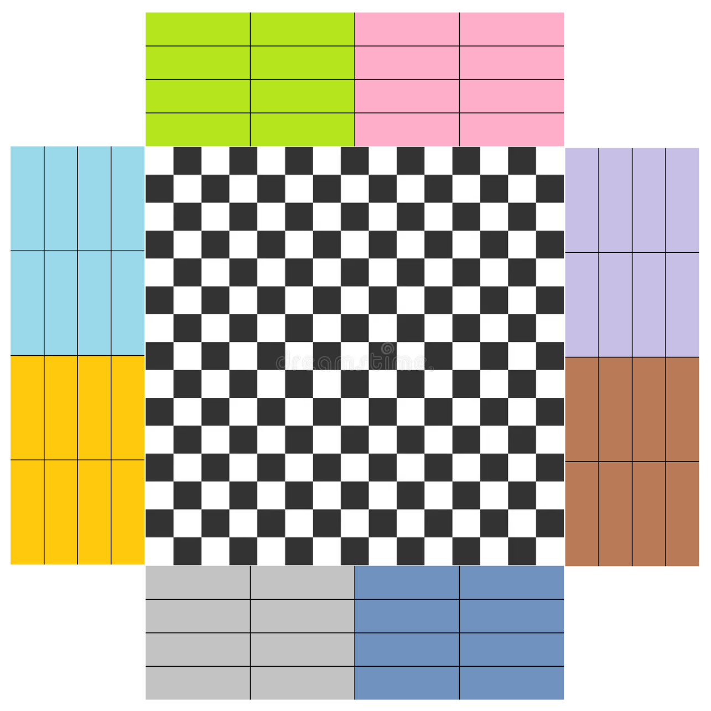
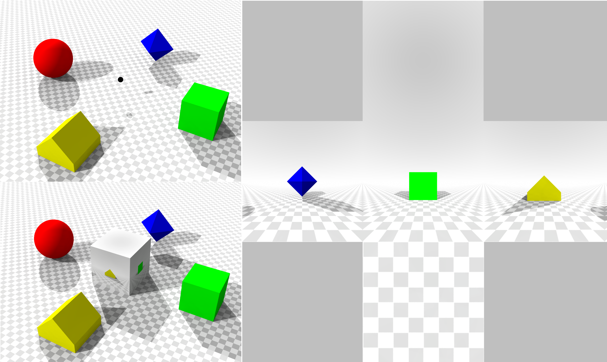
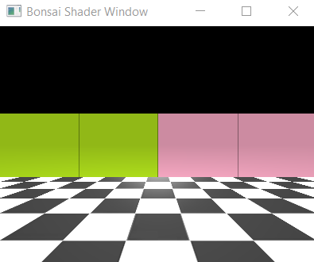
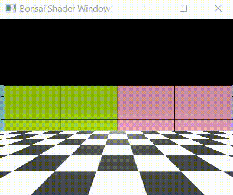
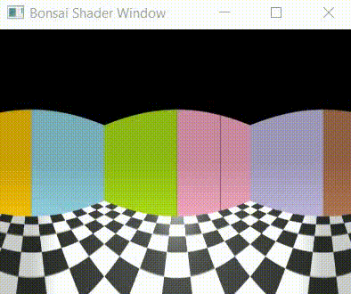
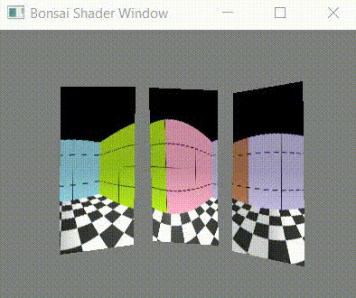

# Virtual Reality Turorial
In this tutorial, you’ll build a complete virtual reality (VR) system in Bonsai, allowing an agent—whether a fly, a fish, or a mouse—to freely explore a 3D environment. The scene is projected onto a 220º cylindrical display surrounding the agent, with two mirrors used to create an immersive panoramic view. Step by step, you’ll learn how to render the environment from the agent’s perspective and generate the images that  accurately replicate what the agent is supposed to see when displayed from a projector (Fig.1).
<br>
<figure style="text-align:center;">
    
    <figcaption><em><strong>Fig.1:</strong> Schematics of the projected image into the cylindrical canvas surrounding the real agent with the aid of two mirrors.</em></figcaption>
</figure>
<br>

## Getting started

### Setting up
This tutorial provides Bonsai programs that you can copy and run directly in your Bonsai environment. Before running the examples, ensure that the necessary packages are installed. To quickly set up a working Bonsai environment, download the provided ZIP file, unzip it to a directory of your choice, and run **Setup.cmd**. This will download all required packages and create a local Bonsai executable, into which you can paste the workflows from this tutorial.

The ZIP file also contains **Shaders** and **Arena** folders with the files used to create and render the 3D environment. These files will be explained in detail throughout the tutorial.


### Shaders graphics library
Bonsai communicates with the graphics card using the **Shaders** library, along with the **BonVision** library (which is essentially an extension of **Shaders**, providing additional shader functions). These libraries allow Bonsai to create and render VR environments, offering operators for graphics rendering and dynamic control of OpenGL shader stages directly within Bonsai’s programming language.

### The VR problem

At its core, the VR problem can be summarized as determining the color of each pixel in an image that the agent sees, so that the agent experiences the illusion of being immersed and moving within a 3D environment. To implement virtual reality worlds in Bonsai — and in VR systems more generally — three key aspects must be addressed:

- **Spatial relationships:** Defining how the agent’s current position relates to the positions of all objects in the 3D environment.

- **Pixel color computation:** Calculating the color of each pixel that forms the agent’s current view.

- **Display mapping:** Ensuring those pixel colors are correctly projected onto the physical display to create a coherent visual experience.

In this tutorial, we will create a cylindrical VR projection spanning [-110º, 110º] around the agent. We will create three views (as shown the image above). The frontal view is projected directly onto the front of the cylinder, covering [-45º, 45º] (shown as the blue arc). Side views are projected with the help of mirrors placed on each side of the arena: the left mirror (green) covers [-110º, -45º], and the right mirror covers [45º, 110º]. Note that the use of mirrors implies a reversal of the projected side-view images, as the reflection flips the visual content. This must be accounted for in the rendering pipeline to ensure the agent perceives a coherent and continuous panoramic view. With this arrangement, the agent experiences full immersion in the 3D environment.


## Cubemap: First-person view of a 3D world
# Somehow add annotations to the texture nodes 
To set up a VR environment in Bonsai, we first need to populate the 3D scene with objects, typically by adding textured 3D meshes. In this tutorial, the scene consists of a square room with four walls and a ground floor (Fig.2 Left).

<br>
<figure style="text-align:center;">
    
    
    
    <figcaption><em><strong>Fig.2: Left</strong> Flattened view of the room with the five textures — four walls and ground — seen from above; <strong>Center</strong> Cubmap view (image adapted from: <a href="https://commons.wikimedia.org/w/index.php?curid=8378562" target="_blank"> SharkD </a>);  <strong>Right</strong> Opengl coordinate system. </em></figcaption>
</figure>
<br>

Next, we create a view of the 3D environment from the perspective of the agent. In Bonsai, this is achieved using a **Cubemap View** centered at the agent’s location. The **Cubemap View** is part of the shaders library and renders the environment onto the six faces of a cube (+X, -X, +Y, -Y, +Z, -Z), generating a full 360° panoramic view of the scene (Fig.2 Center). Notably, in Bonsai shaders, the Y-axis points upward and the agent's default forward direction is along the -Z axis (Fig.2 Right).


The following workflow renders a single view of the Cubemap applied to our 3D scene from the perspective of the agent.

:::workflow

:::

1. Creates a shader window that will render the 3D world, and loads resources related to **BonVision**, and the textures that will be used to cover the walls and the floor.
2. Renders each frame of to be sent to the display. The **RenderFrame** node emits a notification whenever the image of our display device is to be updated.
    1. Creates the **Cubemap view** of the environment as mentioned above. At this stage, the cubemap is located at (0,0) looking forward, in the -Z direction. 
    2. Emits a notification to the **Draw** subject, with the current perspective of the cubemap to draw the virtual world according to that view (3).
    3. Renders the cubemap from its current perspective.
    4. Creates a **Viewpoint** to visualize a part of the cubemap. You can change this view point by modifying the rotation and translation positions of the windows' viewpoint.
3. Draws the 3D world according to the perspective of the cubemap (or given the transform it entails in 1). Each branch, binds the wall and floor textures to five planes arranged in a cubic shape.

This is the resulting image generated in the output window:

<br>
<figure style="text-align:center;">
    
    <figcaption><em><strong>Fig.3:</strong> Snapshot of the the 3d scene rendered from the camera's point of view. </em></figcaption>
</figure>
<br>


## Navigating in the virtual world

To navigate the 3D world, we need to update the cubemap’s position and orientation to match the agent’s movements. First, we define how the agent moves. In this example, we use a simple video game–style control scheme: the *W* and *S* keys move the agent forward and backward, while the *A* and *D* keys rotate it left and right. The following workflow shows how to implement this in Bonsai:

:::workflow

:::

1. Updates the current camera angle whenever keys *A* or *D* are pressed. 
    1. Accumulates the rotation angle
    2. Sets the **CameraOrientation** subject with the updated rotation angle of the camera

2. Updates the current position of the camera whenever keys *W* or *S* are pressed. 
    1. Calculates the forward/backward translation vector given the current orientation of the camera
    2. Creates a **Vector3** with the X,Y, Z translation of the camera
    3. Accumulates the translation vector
    4. Sets the **CameraPosition** subject with the updated position of the camera


Once we know the camera’s position and orientation, we need to update its cubemap **ViewMatrix** to reflect the corresponding translation and rotation. This matrix ensures that each face of the cubemap points in the correct direction. Here’s how we can implement this:

:::workflow

:::

0. Encapsulates the **Shaders** initialization, the **3D Scene** drawing and the **Navigation** workflows we described above.
1. Renders each frame of to be sent to the display.
2. Updates the current position of the camera by setting the **Eye** property of the **CubemapView** node. 
3. Applies a rotation to the cubemap **ViewMatrix**, around the **Y** axis, using the current orientation of the camera.
4. Re-creates the output of the **CubemapView** node with the updated **ViewMatrix**.
5. Emits a notification to the **Draw** subject, with the current perspective of the cubemap, to draw the 3D scene.


A visualization of the final 3D scene rendering, showing the agent navigating the VR environment, is shown in Fig.4.

<br>
<figure style="text-align:center;">
    
    <figcaption><em><strong>Fig.4:</strong> Navigation in the 3D space. </em></figcaption>
</figure>
<br>


## Creating a panoramic view of the cubemap

To create a panoramic view of the cubemap spanning angles greater than 90º, we use a shader that projects the cubemap’s faces onto a cylindrical surface, producing a continuous panoramic image. A shader is a small program that runs directly on the graphics card (GPU) and controls how 3D data is transformed into the final image displayed on screen. There are three main types of shaders:
- **Vertex shader (.vert):** Runs once per vertex. It transforms 3D coordinates—position, normals, and texture coordinates—into the camera’s coordinate system.
- **Fragment shader (.frag):** Runs once per pixel (fragment). It determines the color of each pixel by combining textures, lighting, and material properties.
- **Geometry, tessellation, and compute shaders (advanced):** Add extra geometry, refine details, or perform general GPU computations not directly tied to pixels.

In this tutorial, we will use only a vertex and a fragment shaders. The vertex shader (*panoramic.vert*) is minimal, and its purpose is to draw a quad covering the entire screen:


```glsl
#version 400                      // Use GLSL version 4.00

layout(location = 0) in vec2 vp;  // Input vertex attribute at location 0: 
                                  // a 2D position (clip-space coords [-1,1])

out vec2 uv;                      // Output variable passed to the fragment shader

void main()
{
    uv = vp;                          // Forward the input position to fragment shader as "uv"
    gl_Position = vec4(vp, 0.0, 1.0); // Set the final clip-space position (z=0, w=1)
}
```

Our fragment shader (*panoramic.frag*) takes a fullscreen quad and maps it onto a cylindrical projection of a cubemap environment in the range [-110º,110º]. In other words, it transforms the cubemap into a continuous cylindrical panoramic image:

```glsl
#version 400

in vec2 uv;                  // Input from vertex shader: position of fragment on quad [-1,1]
out vec4 fragColor;          // Output color

uniform samplerCube cubeMap; // Cubemap texture (environment)
uniform float height = 1.0;  // Cylinder height (full height, replaces hardcoded 0.5)
uniform float angleStart = -110; // Start angle for the field of view
uniform float angleEnd = 110;    // End angle for the field of view

void main()
{
    // Convert uv from [-1,1] to [0,1] for easier mapping
    float u = uv.x * 0.5 + 0.5;         // controls the horizontal angle
    float v = uv.y * 0.5 + 0.5;         // controls the vertical position along the cylinder

    // Map u coordinate to the slice's angular range
    float thetaDeg = mix(angleStart, angleEnd, u);
    float theta = radians(thetaDeg); // Convert angle to radians

    // Compute lateral XZ direction of the ray in world space with forward along -Z 
    vec3 dir = normalize(vec3(sin(theta), 0.0, -cos(theta)));

    // Map vertical position into cylinder height [-height/2, +height/2]
    dir.y = (v - 0.5) * height;

    // Clamp vertical coordinate so it stays inside cylinder
    dir.y = clamp(dir.y, -height/2.0, height/2.0);

    // Sample the cubemap texture
    fragColor = texture(cubeMap, dir);
}
```

These two files can be added to Bonsai by editing the **Shaders** property of the **ShaderResource** node, and assigning a *Material* that references the vertex and fragment shader files. The workflow below shows the complete Bonsai setup for rendering a panoramic view of our 3D environment.

:::workflow

:::


0. Encapsulates the **3D Scene** drawing and the **Navigation** workflows we described above.
1. Loads the resources necessary to run the new shader and mesh resources. 
    1. Loads a **Material** named **PanoramicShader** that includes the panoramic.vert and *panoramic.frag* shader files.
    2. Loads a **TextureQuad** named **PanoramicQuad** that will be used to draw the shader into it.
2. Renders each frame of to be sent to the display.
    1. Encapsulates the workflow required to translate and rotate the cubemap acording to the current position and orientation of the camera as described above.
    2. Emits a notification to the **Draw** subject, with the current perspective of the cubemap, to draw the 3D scene.
    3. Renders the cubemap
    4. Binds the rendered cubemap to the **PanoramicShader**. This tells the GPU which texture to sample and which shader program to execute during the next draw call
    5. Draws the **PanoramicShader** into our **PanoramicQuad**.
    6. Creates a view window to display the finished **PanoramicQuad**.


The resulting panoramic rendering of the 3D scene is shown in Fig.5.

<br>
<figure style="text-align:center;">
    
    <figcaption><em><strong>Fig.5:</strong> panoramic rendering of the 3D scene. </em></figcaption>
</figure>
<br>


## Slicing the panoramic view in three  adjustable parts

Often, a panoramic view needs to be divided into independent segments to match the physical layout of the display. In our setup, the projection requires three images—front and two mirrors—that must be produced in a way that, when projected to the canvas, gives the animal the impression of full immersion (see Fig.1). By splitting the panoramic image into three sections—left, front, and right—we can control each viewpoint independently and ensure that each portion aligns correctly with the cylindrical display surrounding the animal. The angles used for each view are:
- **Left view:** [-110º,-45º]
- **Front view:** [-45º,45º]
- **Right view:** [45º,110º] 

Here is the final code:

:::workflow

:::

0. Encapsulates the **Shaders** initialization, the **3D Scene** drawing and the **Navigation** workflows we described above.
1. Renders each frame of to be sent to the display.
    1. Sets the uniform variables **angleStart** and **angleEnd** and draws a different view of the Cubemap in each branch out of the **RenderCubemap**. 
    2. Binds the rendered cubemap to our **PanoramicShader**. This tells the GPU the code that it will need to run in the next draw call.
    3. Draws the **PanoramicShader** into our **PanoramicQuad**.
    4. Creates a view window to display the finished **PanoramicQuad**.
    5. Creates an off-screen framebuffer (texture) that captures a rendered view instead of drawing directly to the window.
    6. Binds the rendered view to the **PanoramicShader**. This tells the GPU which texture to sample and which shader program to execute during the next draw call.
    7. Draws the **PanoramicShader** into our **PanoramicQuad**.
    8. Creates a perspective mapping of the **PanoramicQuad**. This mapping lets us position the four vertices of the quad in display coordinates (by dragging the vertexes with the mouse), making it easy to align the projected image with mirrors and the cylindrical canvas. This is configured by setting the **Destination** property of the **PerspectiveMapping**.
    9. Draws the image from each view in the main window.


The three views composing the final image as the agent navigates in the 3D scene are shown in Fig.6. Note that the side views need to be inverted around the vertical axis to compensate for their reflection from the mirrors. This inversion can be achieved by manually swapping the quad vertices along the vertical direction (see Fig.6). Adjusting these vertices also allows us to fine-tune the final projection, aligning it precisely with the positions of the mirrors and the cylindrical display in the real-world setup.

<br>
<figure style="text-align:center;">
    
    <figcaption><em><strong>Fig.6:</strong> Visualizing the three views of the 3D scence in one window while mirroring the left view image. </em></figcaption>
</figure>
<br>

