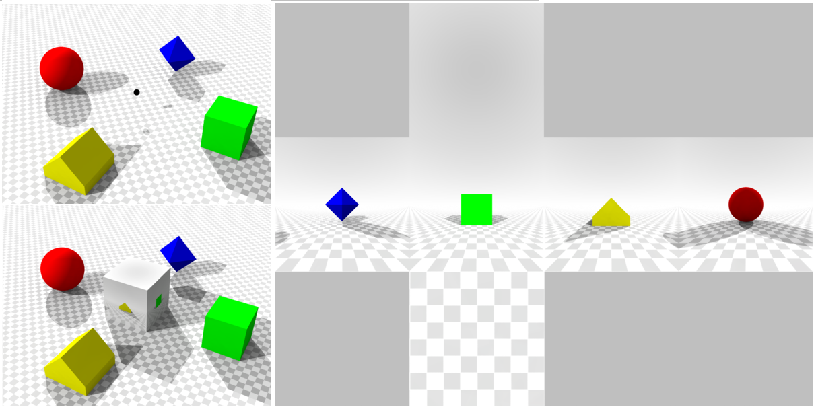

## Virtual Reality

In this tutorial we will show how to create a virtual, cylindrical environment in Bonsai. It allows a virtual agent to navigate in a squared arena. 

## Getting started

In essence, the VR problem can loosely be resumed to defining the pixel colors of the image that needs to be formed in an agent's eye, in order to give the agent the illusion of being immersed (and moving) in a 3D environment. 

To incorporate virtual reality (VR) worlds into Bonsai (and more broadly into other settings), we need to address three key aspects:
1. Defining the relationship between our current position and the positions of all other objects in the 3D world.
2. Determining the color of each pixel in the image that forms our current view.
3. Ensuring those colors are projected correctly onto the display.

In order to do this, Bonsai uses the Shaders library which provides operators for graphics rendering and dynamic control of OpenGL shader stages within Bonsai's programming language. In this tutorial we will use the Shaders as well as the BonVision libraries to define how a virtual environment is projected onto a 220º cylindrical arena around an animal, using a projector.

In this example, we will create a projection that spans [-110º:110º] projector to create a cylindrical projecti arena. The frontal image is projected directly in the frontal part of the cylider and spans 90º, from -45º to 45º (blue arc). The side images are projected with the aid of two mirrors placed on each side of the cylindrical arena. The left mirror (green) covers the range [-110º, -45º] and the right mirror covers the range [45º,110º].

     

## Static first-person view of a 3D world

The first step we need to do is to create a 3D environment with objects in it (i.e. meshes). In this tutorial, the 3D world consists of a square room with four planar walls and a ground floor (also planar).  To do this, we use a Cubemap camera, which is centered around the current viewpoint of the animal, and renders the 3D environment onto six planes of a cube: +X, -X, +Y, -Y, +Z, and -Z, creating a panoramic view of the scene from all sides.

     

The following workflow draws a single view of the Cubemap from the perspective of the agent.

:::workflow

:::

1. Creates a shader window that will render the 3D world, and loads resources related to BonVision, Meshes, Shaders and Textures. Double click on the TextureResources node to load the images that will be used to cover the walls and the floor.
2. Renders each frame of our display. The RenderFrame node emits a notification whenever the image of our display device is to be updated.
    1. Creates the cubemap view of the environment as mentioned above. At this stage the cubemap is located at (0,0) with an angle of 0º with respect to the virtual environment. 
    2. Emits a notification to the BehaviorSubject, with the current perspective of the cubemap with the transformation matrix. This is used to draw the virtual world according to that view (3).
    3. Renders the cubemap from its current perspective.
    4. Creates a viewpoint to visualize a part of the cubemap. You can change this view point by modifying the rotation and translation positions of the windows' viewpoint.
3. Draws the 3D world according to the perspective of the cubemap (or given the transform it entails in 1).

Adapted from: By SharkD - Own work. Download source code., CC BY-SA 3.0, https://commons.wikimedia.org/w/index.php?curid=8378562

## Moving in the 3D world